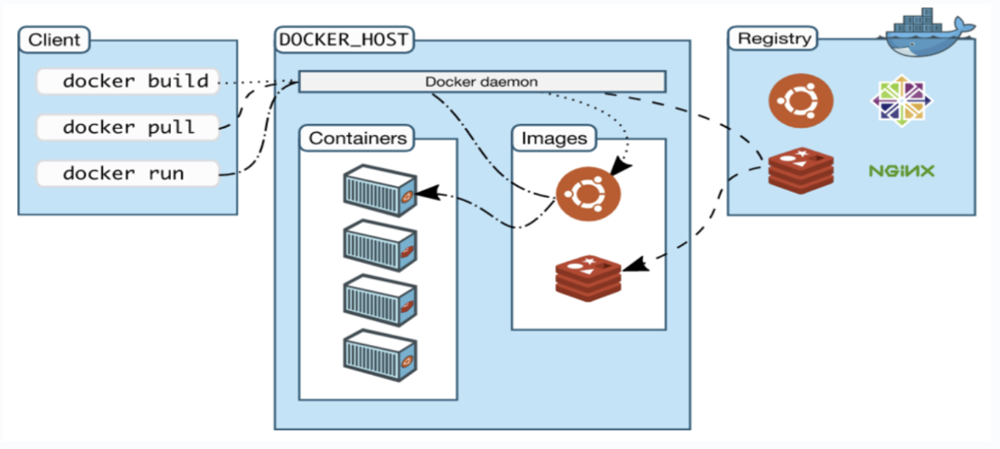
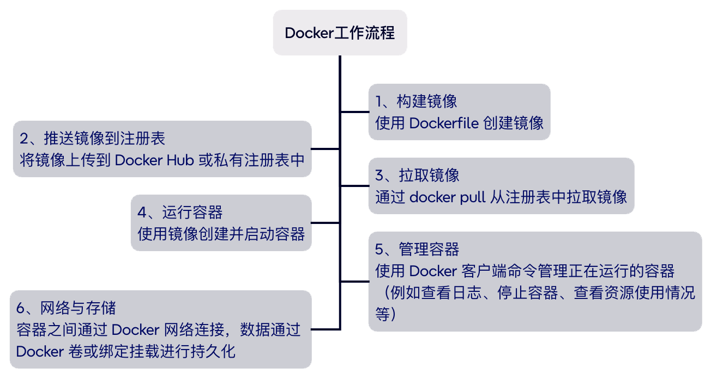

# Docker基础技术

## Docker介绍

在软件开发与部署的实践中，一个普遍存在的痛点始终困扰着技术团队：当项目在本地环境完成开发并正常运行后，版本迭代往往伴随服务不可用的风险，而后期维护更是因需针对每台机器单独进行环境部署与配置调整而变得异常繁琐。尤其在跨平台场景下，这一问题更为突出 —— 例如，在 Windows 系统中开发的包含 JAR 包及 Redis、Elasticsearch、Kafka 等组件的项目，若要部署至服务器，往往需因平台差异重新执行全套环境配置操作。在此背景下，Docker 技术凭借其对项目及依赖环境的整体打包能力，为实现一键部署、规避单独维护成本提供了有效的解决方案。

传统的方法是使用虚拟机技术来测试各种软件，而虚拟机技术具有资源占用多、系统臃肿的缺点，Docker的出现可以避免这些问题。容器内的应用可以直接运行在宿主主机的内核中，容器没有自己的内核，也不用使用虚拟硬件；每个容器是相互隔离的，每个容器内都有属于自己的文件系统，容器与容器之间互不影响。

利用Docker技术可以直接打包镜像发布测试，一键运行；使用容器化技术后，开发和测试环境是高度一致的。这些都为开发带来便利。

## Docker框架

Docker 架构是基于客户端-服务器模式的，其中包括多个关键组件，确保容器化应用的高效构建、管理和运行。Docker 的架构设计使得开发者能够轻松地将应用程序与其所有依赖封装在一个可移植的容器中，并在不同的环境中一致地运行。Docker 使用客户端-服务器 (C/S) 架构模式，使用远程 API 来管理和创建 Docker 容器。Docker 容器通过 Docker 镜像来创建。

##### Docker容器（Containers）

容器是 Docker 的执行环境，它是轻量级、独立且可执行的软件包。容器是从 Docker 镜像启动的，包含了运行某个应用程序所需的一切——从操作系统库到应用程序代码。容器在运行时与其他容器和宿主机共享操作系统内核，但容器之间的文件系统和进程是隔离的

- 提供独立的运行环境，确保应用程序在不同的环境中具有一致的行为
- 容器是临时的，通常在任务完成后被销毁

容器的生命周期是由 Docker 守护进程管理的。容器可以在任何地方运行，因为它们不依赖于底层操作系统的配置，所有的运行时依赖已经封装在镜像中

##### Docker镜像（Images）

Docker 镜像是容器的只读模板。每个镜像都包含了应用程序运行所需的操作系统、运行时、库、环境变量和应用代码等。镜像是静态的，用户可以根据镜像启动容器

- 镜像是构建容器的基础，每个容器实例化时都会使用镜像
- 镜像是只读的，不同容器使用同一个镜像时，容器中的文件系统层是独立的

Docker 镜像可以通过 `docker pull` 从 Docker Hub 或私有注册表拉取，也可以通过 `docker build` 从 Dockerfile 构建

##### Docker仓库（Registries）

Docker 仓库是用来存储 Docker 镜像的地方，最常用的公共仓库是 **Docker Hub**。用户可以从 Docker Hub 下载镜像，也可以上传自己的镜像分享给其他人。除了公共仓库，用户也可以部署自己的私有 Docker 仓库来管理企业内部的镜像。

- 存储 Docker 镜像
- 提供镜像的上传和下载功能

Docker Hub 提供了大量官方和社区维护的镜像，如 Ubuntu、Nginx、MySQL 等

## Docker使用